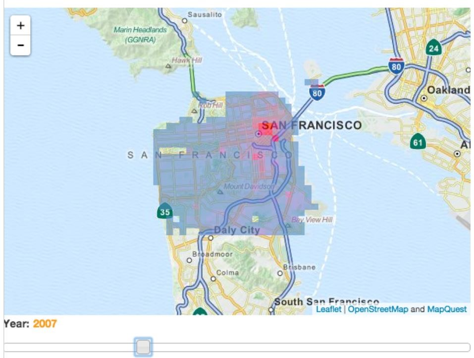
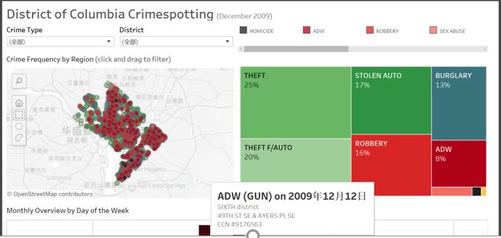

# Crime-Map
During the period of final project, I have done some research on crime maps. As follows is the resouce collection of it.

## Visualizations
* [20-visualizations to understand crime ](https://flowingdata.com/2009/06/23/20-visualizations-to-understand-crime/)

  There’s a lot of crime data. For almost every reported crime, there’s a paper or digital record of it somewhere, which means hundreds of thousands of data points – number of thefts, break-ins, assaults, and homicides as well as where and when the incidents occurred. 
 
 * [New York Crime Map](https://spotcrime.com/ny/new+york)
 
   The New York Times shows that even though you use the Google mapping API, your map doesn’t have to look Googley. Browse New York homicides by type, those involved, and by time. Roll over incidents to get more details about a crime.
 
 * [Flash Face](http://flashface.ctapt.de/)
 
   Flash Face lets you become a sketch artist. Choose hair, head, eyebrows, and all the other details of the face to compose your own criminal sketch. Export and print to create a wanted poster of that neighbor you don’t like.
   
## Approached to Draw Crime Maps
 * [Web App Tutorial](https://www.dataiku.com/learn/guide/tutorials/draw-sfdp-map.html)

* [tableau](https://www.tableau.com/solutions/gallery/crime-spotting)

 * [Rmap package](https://github.com/ramnathv/rMaps)
 
  rMaps makes it easy to create, customize and share interactive maps from R, with a few lines of code. It supports several javascript based mapping libraries like Leaflet, DataMaps and Crosslet, with many more to be added.
  
 * [Interative Map with d3](https://github.com/KunyiLiu/quant-hack)
 
  The project was developed with the Python and JavaScript programming languages. The deliverable is an interactive document provided in the form of a Jupyter notebook with advanced interactive visualizations based on leafletjs, bqplot, d3.js
  
Hope you enjoy!
 
 

   
  
  
